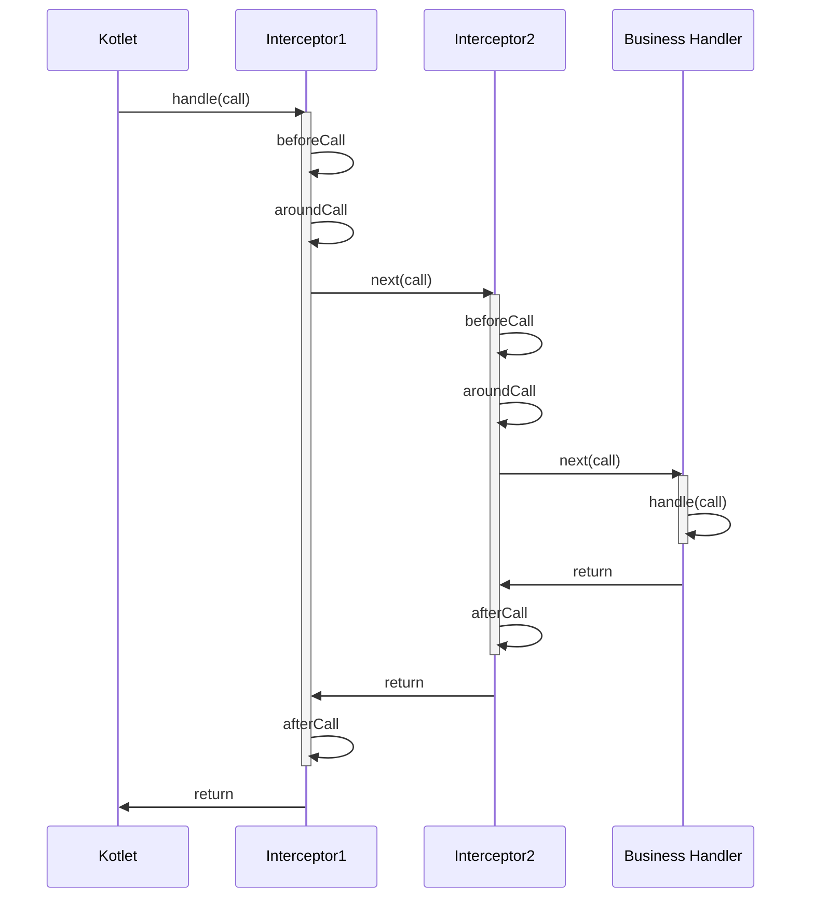
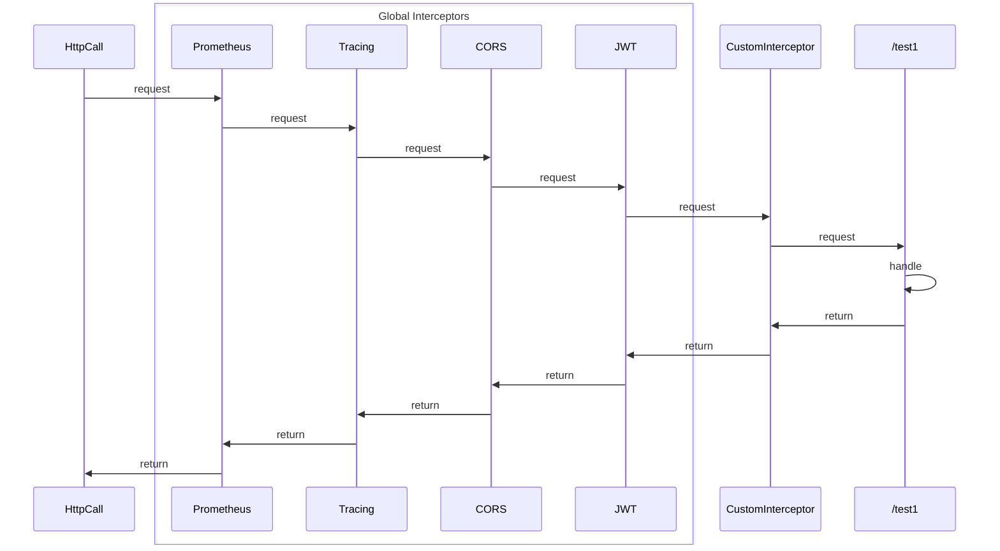

# Kotlet: A playful blend of Kotlin and Servlet with simple routing

Welcome to Kotlet! This library enables you to create routing for web applications using Java Servlets and the Kotlin
programming language. Kotlet is designed for developers who appreciate simplicity and efficiency.

With Kotlet, you can forget about complex configurations and verbose code required for setting up routes. We offer an
intuitive and powerful API that makes the process of creating routes easy and fast.

## Key Features

* Simple Syntax: Use concise and understandable methods to define routes.
* Powerful Functionality: Support for all HTTP methods (GET, POST, PUT, DELETE, and more).
* Integration with Java Servlets: Full compatibility with existing Servlet infrastructure.
* Kotlin Support: Fully utilize Kotlin's features for cleaner and safer code.
* Extensibility: Easily extend functionality with Interceptors and other tools.

# Example Usage

```kotlin
val routing = Kotlet.routing {
    get("/hello") { call ->
        call.responseText("Hello, World!")
    }

    get("/json/{name}") { call ->
        val name = call.parameters["name"]
        call.respondJson(User(name))
    }
}

// create HttpServlet with our routing
val kotlet = Kotlet.servlet(listOf(routing))

// add servlet to your server for example Jetty
server.addServlet(ServletHolder(kotlet), "/*")
```

## Routing methods

Kotlet provides a simple and intuitive syntax for defining routes in your application. The following methods are
available for creating routes:

* `get(path: String, handler: (HttpCall) -> Unit)`
* `post(path: String, handler: (HttpCall) -> Unit)`
* `put(path: String, handler: (HttpCall) -> Unit)`
* `delete(path: String, handler: (HttpCall) -> Unit)`
* `patch(path: String, handler: (HttpCall) -> Unit)`
* `options(path: String, handler: (HttpCall) -> Unit)`
* `head(path: String, handler: (HttpCall) -> Unit)`
* `trace(path: String, handler: (HttpCall) -> Unit)`

### Path Syntax

#### Static Paths

Define a route with a static path:

```kotlin
get("/hello/world") { call ->
    call.responseText("Hello, World!")
}
get("/hello/world/method") { call ->
    call.responseText("Hello, Method!")
}
```

#### Static Path with Parameters

Define a route with parameters in the path:

```kotlin
get("/first/{userId}/second/{fileId}") { call ->
    // Access via /first/123/second/456
    val userId = call.parameters["userId"] // 123
    val fileId = call.parameters["fileId"] // 456
    call.responseText("User: $userId, File: $fileId")
}
```

#### Optional Parameters

Define a route with optional parameters:

```kotlin
get("/first/{userId?}") { call ->
    // Access via /first/123 or /first
    val userId = call.parameters["userId"] // 123 or null
    call.responseText("User: $userId")
}
```

#### Wildcard

Define a route with wildcard parameters:

```kotlin
get("/first/*/second/*") { call ->
    // Access via /first/123/second/456
    call.responseText("Hello from wildcard route")
}
```

#### Tail Path

Define a route with a tail path that captures the rest of the path:

```kotlin
get("/first/{...}") { call ->
    // Access via /first/second/third
    call.responseText("Hello from tail path route")
}
```

#### Complex Paths

Define a route with a combination of static, parameter, wildcard, and tail path elements:

```kotlin
get("/first/{userId}/second/*/third/{...}") { call ->
    // Access via /first/123/second/456/third/789/10
    val userId = call.parameters["userId"] // 123
    call.responseText("User: $userId")
}
```

Kotlet's routing methods provide a flexible way to define HTTP routes with various types of path parameters. Whether
using static paths, dynamic parameters, optional segments, wildcards, or complex combinations, Kotlet makes it easy to
handle different routing scenarios in your application.

## Installation

Add the following dependency to your build.gradle.kts file:

```kotlin
dependencies {
    implementation("com.ecwid:kotlet-core:1.0.0")
}
```

Or to pom.xml if you use Maven:

```xml

<dependency>
    <groupId>com.ecwid</groupId>
    <artifactId>kotlet-core</artifactId>
    <version>1.0.0</version>
</dependency>
```

Define the Kotlet routing in your application, and you're ready to go!

```kotlin
val routing = Kotlet.routing {
    get("/hello") { call ->
        call.responseText("Hello, World!")
    }
}
```

Create HttpServlet with the routing and add it to your server

```kotlin
val kotlet = Kotlet.servlet(listOf(routing))
// add servlet to your server for example Jetty
server.addServlet(ServletHolder(kotlet), "/*")
```

Now your server is ready to handle Kotlet requests!

## Extending Functionality

### Extension libraries

Kotlet provides a set of extensions that can be used to enhance the functionality of your application.

#### CORS

```kotlin
implementation("com.ecwid:kotlet-cors:1.0.0")
```

Configure Cross-Origin Resource Sharing (CORS) for your application using the `cors` method.

```kotlin
Kotlet.routing {
    installCORS(CORS.allowAll) // for development

    // allow only from one origin https://example.com
    installCORS(CORS.allowOrigin("https://example.com"))

    // or implement your own logic
    val myCustomCorsRules = object : CorsRules {
        override fun CorsRules(call: HttpCall): CorsHeaders {
            return CorsHeaders(...)
        }
    }
    installCORS(myCustomCorsRules)
}
```

#### JSON Responses

```kotlin
implementation("com.ecwid:kotlet-json:1.0.0")
```

Library provides a convenient way to return JSON responses from your routes. You can use the `respondJson` method to
serialize an object to JSON and send it as the response.

```kotlin
@Serializable
data class Post(val title: String, val content: String)

@Serializable
data class DocumentPatch(val title: String?, val content: String?)

patch("/document") { call ->
    val documentPatch = call.receiveBody<DocumentPatch>()
    val document = DocumentService.updateDocument(documentPatch)
    call.respondJson(document)
}
```

#### JWT Authentication

```kotlin
implementation("com.ecwid:kotlet-jwt:1.0.0")
```

> [!IMPORTANT]
> For using this extension you must add to your
> dependencies [com.auth0:java-jwt](https://mvnrepository.com/artifact/com.auth0/java-jwt) library.

You can use the `installJWTAuthentication` method to add JWT authentication to your routes. The method takes a
`com.auth0.jwt.interfaces.JWTVerifier` object as a parameter, which contains the logic for constructing and validating
JWT tokens.

```kotlin
val jwtVerifier = JWT.require(Algorithm.HMAC256("secret"))
    .withIssuer("myapp")
    .build()

Kotlet.routing {
    installJWTAuthentication(jwtVerifier)
    get("/authentication") { call ->
        val token = call.identity<DecodedJWT>()
        if (token == null) {
            call.respondError(401, "Unauthorized")
            return@get
        }
        call.responseText("Hello, route!")
    }
}
```

> [!TIP]
> Additionally, you can build your own identity object by providing a `identityBuilder: IdentityBuilder<*>` function.

```kotlin
val jwtVerifier = JWT.require(Algorithm.HMAC256("secret"))
    .withIssuer("myapp")
    .build()

data class MyIdentity(val id: String, val admin: Boolean)

fun buildIdentity(token: DecodedJWT): MyIdentity {
    // convert JWT token to MyIdentity object
    return MyIdentity(...)
}

Kotlet.routing {
    installJWTAuthentication(jwtVerifier, ::buildIdentity)
    get("/authentication") { call ->
        val identity = call.identity<MyIdentity>()
        if (identity == null) {
            call.respondError(401, "Unauthorized")
            return@get
        }

        if (!identity.admin) {
            call.respondError(403, "Forbidden")
            return@get
        }

        call.responseText("Hello, admin!")
    }
}
```

#### Metrics

```kotlin
implementation("com.ecwid:kotlet-metrics:1.0.0")
```

> [!IMPORTANT]
> For using prometheus metrics you must add to your dependencies
> [io.prometheus:prometheus-metrics-core](https://mvnrepository.com/artifact/io.prometheus/prometheus-metrics-core)
> library.

You can use the `installMetrics` method to add metrics to your routes. The method takes a `MetricsCollector` object
as a parameter.

```kotlin
val kotletMetrics = PrometheusMetricsCollector(PrometheusRegistry.defaultRegistry) // this collector can be reused for multiple routes

Kotlet.routing {
    installMetrics(kotletMetrics) // Now all requests of this routing will be measured
    get("/hello") { call ->
        call.responseText("Hello, World!")
    }
}
```

##### Available metrics:

| Metric Name                             | Description                                            |
|-----------------------------------------|--------------------------------------------------------|
| `kotlet_http_requests_total`            | Total number of HTTP requests.                         |
| `kotlet_http_requests_duration_seconds` | Duration of HTTP requests in seconds with percentiles. |

##### Custom metrics

Also, you can define your own metrics collector by implementing the `kotlet.metrics.MetricsCollector` interface, like in
the example below:

```kotlin
class MyMetricsCollector : MetricsCollector {
    override fun startRequest(call: HttpCall) {
        // start timers
    }
    override fun endRequest(call: HttpCall) {
        // measure request and cleanup
    }
}

Kotlet.routing {
    installMetrics(MyMetricsCollector())
    // your routes
}
```

#### Tracing

```kotlin
implementation("com.ecwid:kotlet-tracing:1.0.0")
```

Use the `installTracing` method to add tracing to your routes. The method takes a `OpenTelemetry` object as a parameter.

```kotlin
Kotlet.routing {
    installTracing(GlobalOpenTelemetry.get())
    get("/hello") { call ->
        call.responseText("Hello, World!")
    }
}
```

After that the extension will automatically create spans for each request and send them to the library.

> [!IMPORTANT]  
> You must configure OpenTelemetry before using this extension.

#### Type-Safe request objects

```kotlin
implementation("com.ecwid:kotlet-typesafe:1.0.0")
```

Few helpful methods for parsing request query parameters: `receivePath` and `receiveQuery`.

```kotlin
@Serializable
data class UserPath(val name: String)

@Serializable
data class UserQuery(val age: Int, val city: String)

post("/user/{name?}") { call ->
    // /user/John?age=30&city=New York
    val user = call.receivePath<UserPath>() // UserPath(name = "John")
    val query = call.receiveQuery<UserQuery>() // UserQuery(age = 30, city = "New York")
    update(user, query)
    call.respondJson(user)
}
```

### Interceptors

Kotlet provides an interceptor functionality that allows you to intercept requests and responses. You can use
interceptors to add custom logic before or after handling a request, such as logging, authentication, or error handling.

To create an interceptor, implement the `kotlet.Interceptor` interface and override one of the following methods:
`beforeCall`, `aroundCall` or `afterCall`. Then add the interceptor to the routing using the `use` or `install` method.

#### Types of interceptors

There are two types of interceptors: global and route-specific. The difference between them is that global interceptors
are applied to all routes, while route-specific interceptors are applied only to specific route handlers.

To add a global interceptor, use the `install` method:

```kotlin
Kotlet.routing {
    install(MyInterceptor()) // this is a global interceptor

    get("/hello", ::hello) // MyInterceptor will be applied to this route
}
```

To add a route-specific interceptor, use the `use` method

```kotlin
Kotlet.routing {
    use(MyInterceptor1()) {
        get("/hello", ::hello) // MyInterceptor will be applied to this route
        use(MyInterceptor2()) {
            get("/world", ::world) // MyInterceptor1 and MyInterceptor2 will be applied to this route
        }
    }
}
```

or `withInterceptor` method from the route settings block

```kotlin
Kotlet.routing {
    get("/hello", ::hello) { // MyInterceptor will be applied to this route
        withInterceptor(MyInterceptor())
    }
}
```

> [!NOTE]
> Global interceptors have a peculiarity: if we have defined only one route `/test` with the `GET` method, then the
> global interceptors will be applied to any http method i.e. `GET`, `POST`, `PUT`, etc. but only for `/test` route.
> Route-specific interceptors will be applied only to `GET` `/test` requests.

#### Interceptor methods:

The `beforeCall` method is called before the request is processed and can return a new HttpCall object to modify the
request.
The `aroundCall` method receives the current `HttpCall` object and `next` function to proceed with the request handling.
For continuation, aroundCall should call `next` with the `HttpCall` object. Additionally, `aroundCall` may not call
`next` function to abort processing the request.
The `afterCall` method is called after the request is processed and can be used to clean up resources or perform other
actions.

Interceptors can be nested, allowing you to create a chain of interceptors that process requests in a specific order.

For example: we have two interceptors, Interceptor1 and Interceptor2.

```kotlin
Kotlet.routing {
    use(Interceptor1, Interceptor2) {
        get("/hello", ::BusinessHandler)
    }
}
```

Here is a diagram of how they will be called:



#### Combining Interceptors

Extension implemented as interceptors, so you can combine them all.

```kotlin
Kotlet.routing {
    // Global interceptors, order matters
    installPrometheus(registry)
    installTracing(tracing.openTelemetry)
    installCORS(CORS.allowAll)
    installJWTAuthentication(Auth.createVerifier(), identityBuilder = User::fromJWT)

    // Route specific interceptors
    get("/test1", ::test1) {
        withInterceptor(CustomInterceptor) // the same as use(CustomInterceptor), but only for this route
    }

    use(CustomInterceptor) {
        get("/test2", ::test2)
    }
}
```



### Error Handling

Kotlet support error handling by providing a way to define error handlers for few types of errors:

* `routeNotFound`: Invoked when no route matches the request path.
* `methodNotFound`: Invoked when the route matches the request path but does not support the request method.
* `internalServerError`: Invoked when an exception occurs during request processing.

For overriding default error handling you can implement `kotlet.ErrorsHandler` interface and provide it to
`Kotlet.servlet` method.

## Contributing

We welcome your contributions and suggestions! Open an issue or create a pull request in our repository.
