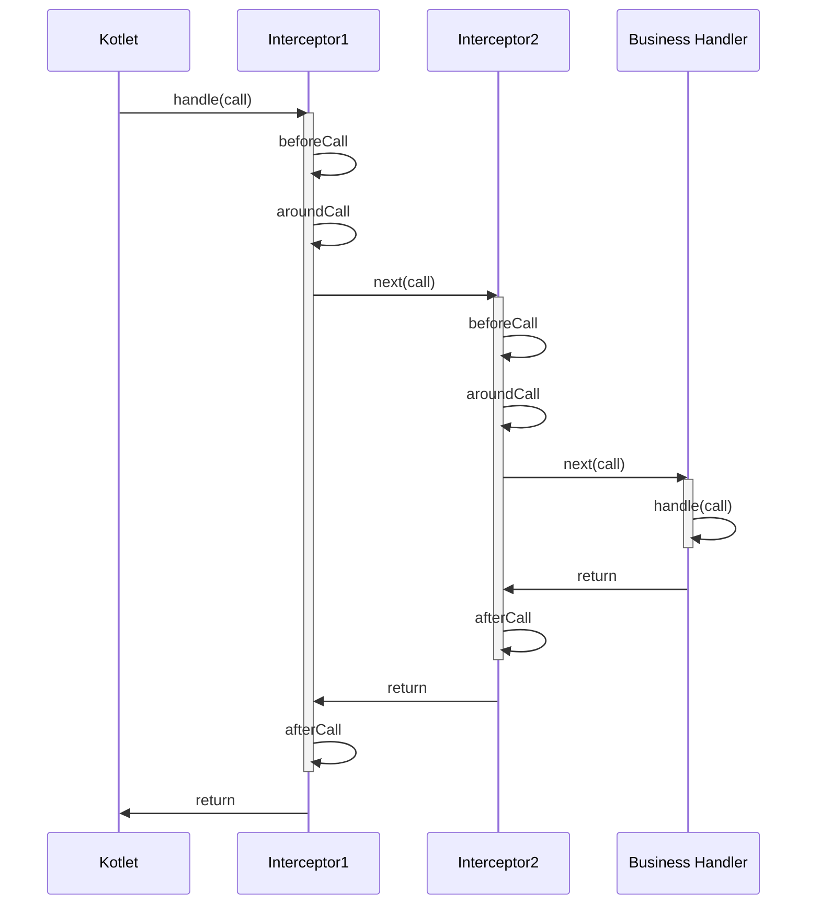
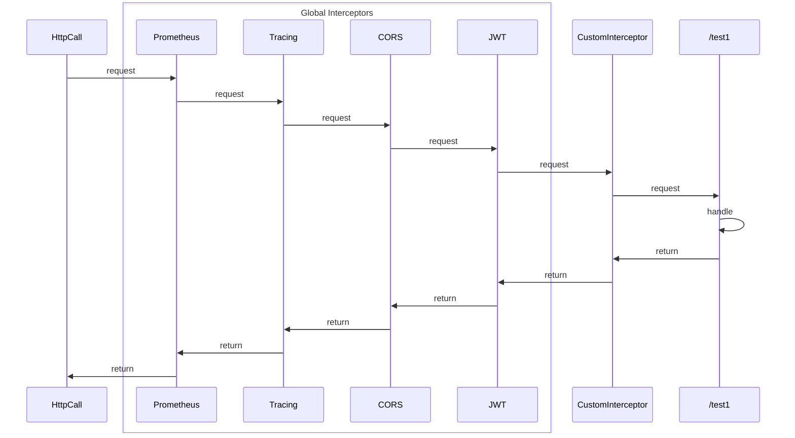

# Interceptors

Kotlet provides an interceptor functionality that allows you to intercept requests and responses. You can use
interceptors to add custom logic before or after handling a request, such as logging, authentication, or error handling.

To create an interceptor, implement the `kotlet.Interceptor` interface and override one of the following methods:
`beforeCall`, `aroundCall` or `afterCall`. Then add the interceptor to the routing using the `use` or `install` method.

## Types of interceptors

There are two types of interceptors: global and route-specific. The difference between them is that global interceptors
are applied to all routes, while route-specific interceptors are applied only to specific route handlers.

To add a global interceptor, use the `install` method:

```kotlin
Kotlet.routing {
    install(MyInterceptor()) // this is a global interceptor

    get("/hello", ::hello) // MyInterceptor will be applied to this route
}
```

To add a route-specific interceptor, use the `use` method

```kotlin
Kotlet.routing {
    use(MyInterceptor1()) {
        get("/hello", ::hello) // MyInterceptor will be applied to this route
        use(MyInterceptor2()) {
            get("/world", ::world) // MyInterceptor1 and MyInterceptor2 will be applied to this route
        }
    }
}
```

or `withInterceptor` method from the route settings block

```kotlin
Kotlet.routing {
    get("/hello", ::hello) { // MyInterceptor will be applied to this route
        withInterceptor(MyInterceptor())
    }
}
```

> [!NOTE]
> Global interceptors have a peculiarity: if we have defined only one route `/test` with the `GET` method, then the
> global interceptors will be applied to any http method i.e. `GET`, `POST`, `PUT`, etc. but only for `/test` route.
> Route-specific interceptors will be applied only to `GET` `/test` requests.

#### Interceptor methods:

The `beforeCall` method is called before the request is processed and can return a new HttpCall object to modify the
request.
The `aroundCall` method receives the current `HttpCall` object and `next` function to proceed with the request handling.
For continuation, aroundCall should call `next` with the `HttpCall` object. Additionally, `aroundCall` may not call
`next` function to abort processing the request.
The `afterCall` method is called after the request is processed and can be used to clean up resources or perform other
actions.

Interceptors can be nested, allowing you to create a chain of interceptors that process requests in a specific order.

For example: we have two interceptors, Interceptor1 and Interceptor2.

```kotlin
Kotlet.routing {
    use(Interceptor1, Interceptor2) {
        get("/hello", ::BusinessHandler)
    }
}
```

Here is a diagram of how they will be called:



## Combining Interceptors

Extension implemented as interceptors, so you can combine them all.

```kotlin
Kotlet.routing {
    // Global interceptors, order matters
    installPrometheus(registry)
    installTracing(tracing.openTelemetry)
    installCORS(CORS.allowAll)
    installJWTAuthentication(Auth.createVerifier(), identityBuilder = User::fromJWT)

    // Route specific interceptors
    get("/test1", ::test1) {
        withInterceptor(CustomInterceptor) // the same as use(CustomInterceptor), but only for this route
    }

    use(CustomInterceptor) {
        get("/test2", ::test2)
    }
}
```


